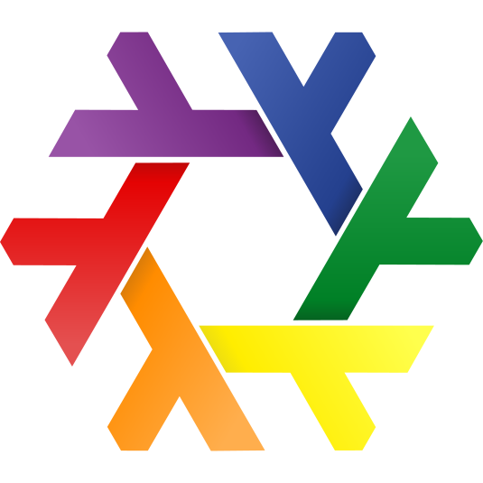

<!-- .slide: data-background-iframe="./assets/slide1_bg.html" -->

## Remote Execution with Nix + Buck2

by Claudio Bley

<p style="font-size: smaller">FOSDEM<sup>'25</sup> &mdash; 1st February 2025</p>

Note: Me, scalable builds group, tweag. Polyglot build system.

---

## Background

* Mercury https://mercury.com/
* large Haskell code base, > 10k modules
* uses flakes ❄
* migration to Buck2

---


## Buck2

https://buck2.build/

<q>fast, reliable, extensible</q>

* polyglot build system from Meta
* supports distributed builds and caching

Notes: still being worked on, no official release yet, just use latest snapshots, OSS version / internal version, support for telemetry and persistent remote worker support by Andreas

---

## Remote Execution

* Faster build and test execution through scaling of nodes available for parallel actions
* A consistent execution environment for a development team
* Reuse of build outputs across a development team

<smaller>source: [Bazel Remote Execution Overview](https://bazel.build/remote/rbe) ↗</smaller>

---

## Remote Execution

- Linux: custom Docker build image
- macOS: more challenging, expensive

=> re-use Linux setup and build for Linux on macOS

[Bazel remote execution with rules_nixpkgs](https://www.tweag.io/blog/2024-02-29-remote-execution-rules-nixpkgs/) ↗

---

## Nix: Remote Builders

- forward builds to other machines
- multiple builds in parallel
- multi-platform builds

```
builders = @/etc/nix/machines
```

```
ssh-ng://nix@x1 x86_64-linux /root/.ssh/id_ed25519 5 1 big-parallel,kvm,nixos-test - -
```

---

## Buck2: Remote Execution

- OSS variant: Bazel remote APIs (execution, asset, logstream)
- services (Buildbarn, NativeLink, BuildBuddy, EngFlow, ...)
- clients (Bazel, Buck2, Pants, Recc, ...)

[API Users](https://github.com/bazelbuild/remote-apis?tab=readme-ov-file#api-users) ↗ 

---

## Buck2: Remote Execution

- distributed to workers
- works on the action level
- caching
- telemetry / UI / graphs

---

## Demo

Notes: cells, toolchains, targets, dependency graph

---

### Thank you

<div style="justify-content: center; display: flex; align-items: center">
</img>
<span style="padding-left: 1em; padding-right: 1em">➕</span>

<span style="padding-left: 1em; padding-right: 1em">🟰</span>
<svg xmlns="http://www.w3.org/2000/svg" style="color: yellow; max-height: 3em" viewBox="0 0 512 512"><!--!Font Awesome Free 6.6.0 by @fontawesome - https://fontawesome.com License - https://fontawesome.com/license/free Copyright 2024 Fonticons, Inc.--><path fill="currentColor" d="M464 256A208 208 0 1 0 48 256a208 208 0 1 0 416 0zM0 256a256 256 0 1 1 512 0A256 256 0 1 1 0 256zm177.6 62.1C192.8 334.5 218.8 352 256 352s63.2-17.5 78.4-33.9c9-9.7 24.2-10.4 33.9-1.4s10.4 24.2 1.4 33.9c-22 23.8-60 49.4-113.6 49.4s-91.7-25.5-113.6-49.4c-9-9.7-8.4-24.9 1.4-33.9s24.9-8.4 33.9 1.4zM144.4 208a32 32 0 1 1 64 0 32 32 0 1 1 -64 0zm192-32a32 32 0 1 1 0 64 32 32 0 1 1 0-64z"/></svg><span style="padding-left: 1em; padding-right: 1em"></div>

<div style="position: relative">
<div style="transform: rotate(-28deg); position: absolute; top: 2em; right: 1em; font-size: larger">Questions?</div>
</div>

Notes: convinced that combining buck2 + nix is a match
